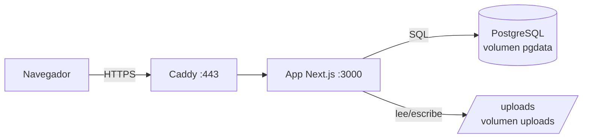
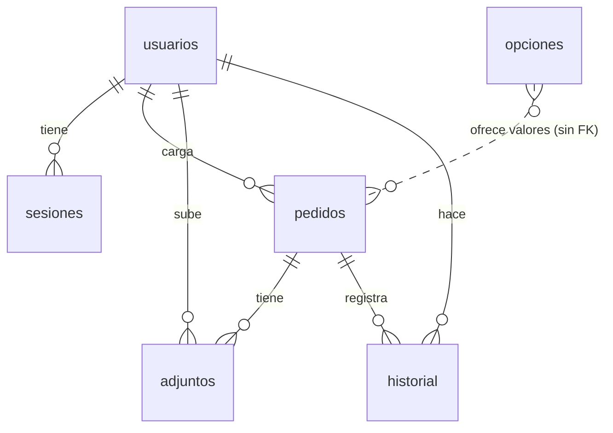
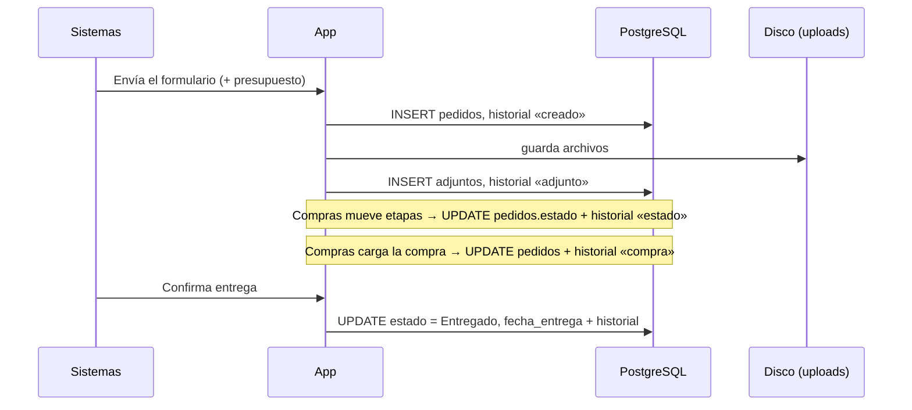

# Cómo guarda los datos Pedidos Sistemas

Este documento explica **dónde** se guarda cada dato, **qué** datos se guardan (tabla por tabla y campo por campo), **cuándo** se crean, modifican o borran, y **qué no** se guarda.

## Resumen

| Qué | Dónde | En el VPS (Docker) | En desarrollo |
|---|---|---|---|
| Usuarios, sesiones, pedidos, historial, listas de opciones, metadatos de archivos | PostgreSQL 17 | volumen `pgdata` | contenedor `app-sistemas-db-1`, puerto 5433, volumen `pgdata-dev` |
| Archivos subidos (presupuestos, fotos, facturas) | Disco | volumen `uploads` → `/app/uploads` | carpeta `uploads/` del proyecto |
| Certificados HTTPS | Disco (Caddy) | volúmenes `caddy_data` y `caddy_config` | no se usan |
| Tema elegido, estado de la barra lateral, sesión | Navegador de cada usuario | — | — |



Todo lo que se guarda pasa por el servidor. El navegador nunca habla con la base de datos ni con el disco. La base no se expone a internet: solo la app la ve, dentro de la red interna de Docker.

---

## Base de datos

La estructura está definida en código, en [`src/db/schema.ts`](../src/db/schema.ts). Los cambios se aplican con migraciones SQL (carpeta [`drizzle/`](../drizzle)), que la app ejecuta sola cada vez que arranca.



### `usuarios` — quién puede entrar

| Columna | Tipo | Qué guarda |
|---|---|---|
| `id` | serial | Identificador interno |
| `nombre` | texto | Nombre y apellido |
| `email` | texto, único | Usuario para ingresar (en minúsculas) |
| `password_hash` | texto | **Hash scrypt** de la contraseña, con sal aleatoria. La contraseña en claro nunca se guarda |
| `rol` | `admin` \| `compras` \| `sistemas` | Qué puede hacer |
| `activo` | booleano | Si está en `false`, no puede ingresar |
| `ultimo_ingreso` | fecha y hora | Último login exitoso |
| `created_at`, `updated_at` | fecha y hora | Alta y última modificación |

- **Se crea:** el primer admin se crea solo al arrancar con la base vacía, con `ADMIN_EMAIL` y `ADMIN_PASSWORD` del `.env`. El resto se crea desde «Usuarios» o con `scripts/usuario.mjs`.
- **Se borra:** nunca desde la app. Para quitarle el acceso a alguien, se lo desactiva, y así sus pedidos siguen mostrando quién los cargó.

### `sesiones` — quién tiene la sesión abierta

| Columna | Qué guarda |
|---|---|
| `id` | **SHA-256 del token** de la cookie. El token en claro solo existe en el navegador del usuario |
| `usuario_id` | A quién pertenece (si se borra el usuario, se borran sus sesiones) |
| `expira_en` | Vencimiento: 30 días después del login |
| `created_at` | Cuándo se inició |

- **Se crea:** al ingresar.
- **Se borra:**
  - al cerrar sesión;
  - al desactivar al usuario o cambiarle la contraseña (se cierran todas sus sesiones);
  - las vencidas se limpian solas cada vez que alguien ingresa.

### `pedidos` — el corazón de la app

**Datos del pedido** (los del formulario de Google, los carga Sistemas):

| Columna | Campo del formulario | Tipo |
|---|---|---|
| `fecha_pedido` | Fecha de pedido | fecha |
| `solicitante_sector` | Solicitante del sector | texto (valor de la lista) |
| `sector` | ¿Qué sector solicitó la compra? | texto |
| `solicitante` | Nombre y apellido del solicitante | texto |
| `facturar_por` | Facturar por | texto (valor de la lista, o NA) |
| `domicilio_entrega` | Domicilio de entrega | texto (opción de la lista o lo escrito en «Otro») |
| `prioridad` | Prioridad | `Baja` \| `Media` \| `Alta` \| `Urgente` |
| `producto` | Producto solicitado | texto |
| `cantidad` | Cantidad | entero ≥ 1 |
| `link` | Link | texto libre |
| `comentarios` | Comentarios adicionales | texto |
| — | Presupuesto pedido por el sector | los archivos van a la tabla `adjuntos` (tipo `referencia`) |

**Seguimiento:**

| Columna | Qué guarda |
|---|---|
| `id` | Número del pedido. Se muestra como `PED-00001` |
| `creado_por_id` | Usuario que lo cargó |
| `estado` | `Solicitado` → `Cotizando` → `Comprando` → `Entregado` |
| `estado_desde` | Desde cuándo está en la etapa actual (sirve para las alertas de pedidos trabados) |
| `cancelado`, `cancelado_en`, `cancelado_motivo` | Cancelación: el pedido no se borra, queda marcado |
| `created_at`, `updated_at` | Alta y última modificación |

**Datos de compra** (los completa Compras):

| Columna | Qué guarda |
|---|---|
| `medio_compra` | Mercado Libre, proveedor directo, etc. (valor de la lista) |
| `proveedor`, `cuit` | Proveedor y su CUIT |
| `fecha_compra` | Se completa sola con la fecha del día al pasar a «Comprando», si estaba vacía |
| `fecha_entrega` | Se completa sola al pasar a «Entregado», si estaba vacía |
| `codigo_seguimiento` | Código de seguimiento o palabra clave |
| `medio_pago`, `cuotas` | Tarjeta o medio de pago, y cantidad de cuotas |
| `importe` | Importe total, numérico con 2 decimales |
| `factura_numero`, `tipo_factura`, `factura_link` | Datos de la factura (el archivo va a `adjuntos`, tipo `factura`) |
| `notas_compras` | Notas internas de Compras |

**Cómo se usan estos datos:**
- **«Compras efectuadas»:** muestra los pedidos no cancelados que están en «Comprando» o «Entregado».
- **«Gasto» (mes, reportes):** suma `importe`. Para ubicar cada compra en el tiempo usa `fecha_compra`, o `fecha_pedido` si todavía no tiene fecha de compra.

### `adjuntos` — archivos subidos

La base guarda solo los **datos del archivo**. El contenido va al disco.

| Columna | Qué guarda |
|---|---|
| `id` | UUID. Es lo que aparece en la URL `/api/archivos/<id>` |
| `pedido_id` | A qué pedido pertenece |
| `tipo` | `referencia` (presupuesto o archivos del sector) o `factura` |
| `nombre` | Nombre original del archivo, tal como lo subió el usuario |
| `mime` | Tipo real detectado por el contenido, no por lo que dice el navegador |
| `tamano` | Tamaño en bytes |
| `ruta` | Dónde está en disco, relativa a la carpeta de subidas: `2026/09/<uuid>.pdf` |
| `subido_por_id`, `created_at` | Quién y cuándo |

### `historial` — auditoría de cada pedido

Cada cambio queda registrado con **quién** y **cuándo**. No se edita ni se borra desde la app.

| `accion` | Cuándo se registra | `detalle` |
|---|---|---|
| `creado` | Al cargar el pedido | «Pedido cargado» |
| `estado` | Al cambiar de etapa | `Cotizando → Comprando` |
| `edicion` | Al editar datos del pedido | Qué campos cambiaron (no los valores) |
| `compra` | Al guardar datos de compra | Qué campos cambiaron |
| `adjunto` | Al subir archivos | Cuántos y de qué tipo |
| `adjunto_borrado` | Al quitar un archivo | Nombre del archivo |
| `cancelado` / `reactivado` | Al cancelar o reactivar | Motivo de la cancelación |

### `opciones` — listas desplegables

| Columna | Qué guarda |
|---|---|
| `lista` | `solicitante_sector`, `empresa`, `domicilio`, `medio_compra`, `medio_pago`, `tipo_factura` |
| `valor` | El texto de la opción |
| `orden` | Posición en el desplegable |
| `activo` | Si está apagada, deja de ofrecerse |

Los pedidos guardan el **texto** elegido, no una referencia a la opción. Por eso, si mañana se apaga una empresa o un solicitante, los pedidos viejos conservan el valor original. Cada lista vacía se carga sola al arrancar con los valores iniciales del formulario ([`src/lib/constants.ts`](../src/lib/constants.ts)).

### `drizzle.__drizzle_migrations` — control de versiones de la base

Registro interno de las migraciones ya aplicadas (un hash por archivo de `drizzle/`). No hay que tocarlo.

---

## Archivos en disco

- **Carpeta:** `UPLOAD_DIR`. En Docker es `/app/uploads`, sobre el volumen `uploads`.
- **Estructura:** `AAAA/MM/<uuid>.<ext>`. El nombre en disco es aleatorio: el nombre original solo está en la base.
- **Qué se acepta:**
  - JPG, PNG, WEBP, GIF, PDF, XLSX, DOCX, XLS y DOC.
  - Hasta 10 MB por archivo y 5 por envío.
  - El tipo se verifica leyendo los primeros bytes del archivo: un `.exe` renombrado a `.pdf` se rechaza.
- **Cómo se accede:** solo a través de `/api/archivos/<id>`, que exige tener la sesión iniciada. Imágenes y PDF se muestran en el navegador; Excel y Word se descargan. No hay ninguna URL pública a la carpeta.
- **Cuándo se borra:** al quitar el adjunto desde el pedido, o al eliminar el pedido (el admin). Cancelar un pedido **no** borra sus archivos.

## En el navegador de cada usuario

| Qué | Dónde | Para qué |
|---|---|---|
| `ps_sesion` | Cookie httpOnly (JavaScript no la puede leer), `SameSite=Lax`, `Secure` cuando se entra por HTTPS, 30 días | El token de la sesión |
| `sidebar_state` | Cookie, 7 días | Si la barra lateral está abierta o cerrada |
| `theme` | localStorage | Tema claro, oscuro o según el sistema |

## Qué NO se guarda

- Contraseñas en claro, ni el token de sesión en claro (en la base solo están sus hashes).
- Direcciones IP. El límite de intentos de login las usa **en memoria**: se pierden al reiniciar la app y no se escriben en ningún lado.
- Analítica, métricas de uso o datos enviados a terceros. La app no llama a ningún servicio externo.
- Datos de tarjetas: «medio de pago» es solo el nombre (VISA, AMEX...), nunca números.

## Ciclo de vida de un pedido



| Acción | Qué pasa con los datos | ¿Reversible? |
|---|---|---|
| Cancelar pedido | Se marca `cancelado`, no se borra nada | Sí, con «Reactivar» |
| Desactivar usuario | `activo = false` y se cierran sus sesiones | Sí |
| Apagar una opción de lista | `activo = false`, los pedidos conservan el texto | Sí |
| Quitar un adjunto | Se borra la fila y el archivo del disco | No (solo con un backup) |
| Eliminar pedido (solo admin) | Se borran el pedido, su historial, sus adjuntos y sus archivos | No (solo con un backup) |

## Backups

`bash scripts/backup.sh` guarda en `backups/AAAA-MM-DD_HHMM/`:

- `base.dump`: toda la base (`pg_dump` en formato custom).
- `archivos.tar.gz`: toda la carpeta de subidas.

Conserva los 14 más recientes. `bash scripts/restaurar.sh <carpeta>` devuelve **ambas cosas** al estado del backup. Los dos archivos van juntos: la base sin los archivos deja adjuntos «rotos», y los archivos sin la base quedan huérfanos.

## Consultar los datos a mano

```bash
# En el VPS
docker compose exec db psql -U pedidos -d pedidos

# En desarrollo
docker compose -f docker-compose.dev.yml exec db psql -U pedidos -d pedidos
npm run db:studio        # interfaz web para explorar las tablas
```

Algunas consultas útiles:

```sql
-- Pedidos por etapa
select estado, count(*) from pedidos where not cancelado group by estado;

-- Gasto por mes
select to_char(coalesce(fecha_compra, fecha_pedido), 'YYYY-MM') mes, sum(importe)
from pedidos where not cancelado and importe is not null group by 1 order by 1;

-- Todo lo que pasó con un pedido
select h.created_at, u.nombre, h.accion, h.detalle
from historial h left join usuarios u on u.id = h.usuario_id
where h.pedido_id = 1 order by h.created_at;
```
